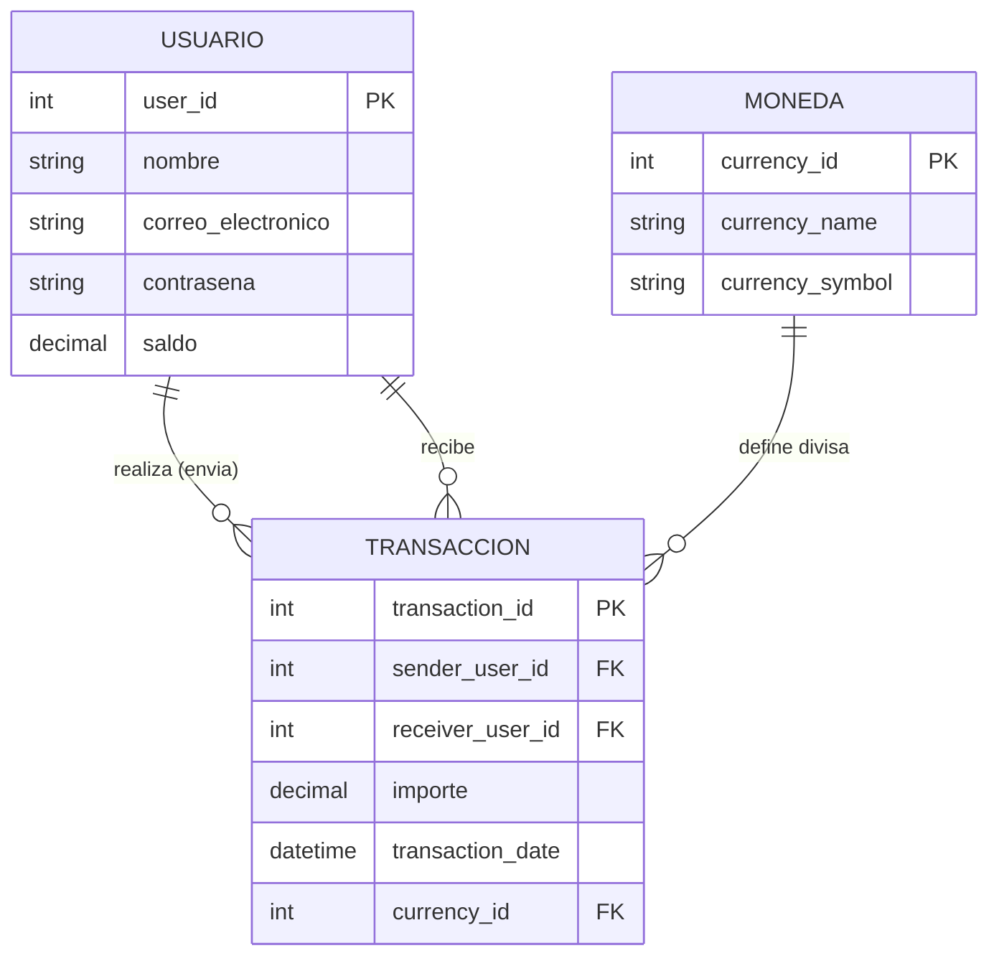

# Wallet Chile 💰

Bienvenido a **Wallet Chile**, una aplicación web de billetera digital que permite gestionar saldo, realizar transferencias, depósitos y pagos de servicios. Este proyecto cumple con los requerimientos de integración de tecnologías web estándar, **Firebase** para autenticación en la nube y **PostgreSQL** (administrado vía **pgAdmin**) para la persistencia y consulta de datos relacionales.

## 🚀 Características Principales

*   **Autenticación y Seguridad**: 
    *   Inicio de sesión seguro con **Firebase Authentication**.
    *   **Cierre de sesión automático** tras 5 minutos de inactividad.
    *   Recuperación de contraseña con simulación de código SMS.
*   **Saldo en Tiempo Real**: Visualización del saldo de la cuenta corriente actualizado al instante.
*   **Transferencias y Contactos**: 
    *   Envío de dinero a contactos con validación de fondos.
    *   **Gestión de Agenda**: Funcionalidad para agregar y guardar nuevos contactos.
    *   Historial sincronizado en la nube (Firestore).
*   **Historial de Movimientos**: Listado de transacciones (depósitos, compras, transferencias) filtrable y ordenado por fecha, leyendo directamente desde la base de datos.
*   **Productos Financieros**:
    *   **Línea de Crédito Inteligente**: Uso automático del cupo si el saldo es insuficiente y gestión de pagos.
    *   **Tarjeta de Crédito**: Visualización de cupo nacional (CLP) e internacional (USD), con simulación de seguridad (CVV oculto tras clave) y pagos.
*   **Pago de Servicios**: Interfaz para pago de cuentas básicas (Luz, Agua, etc.) y recargas.
*   **Administración de Datos**:
    *   Conexión a base de datos relacional **PostgreSQL**.
    *   Scripts de automatización y consulta en **Python**.
    *   Gestión visual de tablas y registros mediante **pgAdmin**.

## 🛠️ Tecnologías Utilizadas

*   **Frontend**: HTML5, CSS3.
*   **Frameworks y Librerías**:
    *   [jQuery](https://jquery.com/) (Manipulación del DOM y lógica de eventos).
    *   [Bootstrap 5](https://getbootstrap.com/) (Diseño responsivo, modales y componentes UI).
*   **Backend y Base de Datos**:
    *   **Firebase Authentication**: Gestión de identidad y sesiones.
    *   **Firebase Firestore**: Base de datos NoSQL para persistencia de transacciones y usuarios.
    *   **PostgreSQL & pgAdmin**: Base de datos relacional y herramienta de administración.
    *   **Python**: Lenguaje para scripts de backend (`psycopg2`).

## 📊 Modelo de Datos (Diagrama ER)

El siguiente diagrama representa la estructura de la base de datos relacional diseñada para la Wallet:



## 📋 Guía de Instalación y Uso

Para ejecutar este proyecto localmente, sigue estos pasos:

1.  **Clonar el repositorio** (o descargar los archivos):
    ```bash
    git clone https://github.com/Magr1990/WALLET_CHILE_ABP5.git
    ```

2.  **Configurar Firebase**:
    *   Crea un nuevo proyecto en [Firebase Console](https://console.firebase.google.com/).
    *   Habilita **Authentication** y activa el proveedor de "Correo electrónico/Contraseña".
    *   Crea una base de datos en **Firestore Database**.
    *   Obtén tus credenciales de configuración web (`apiKey`, `projectId`, etc.) desde la configuración del proyecto.

3.  **Actualizar Credenciales en el Código**:
    *   Abre los archivos `.html` principales (`login.html`, `menu.html`, `sendmoney.html`, etc.).
    *   Busca la constante `firebaseConfig` y reemplázala con tus propias credenciales:

    ```javascript
    const firebaseConfig = {
        apiKey: "TU_API_KEY",
        authDomain: "TU_PROYECTO.firebaseapp.com",
        projectId: "TU_PROYECTO",
        // ... resto de tus credenciales
    };
    ```

4.  **Configuración de Base de Datos (PostgreSQL & pgAdmin)**:
    *   Abre **pgAdmin 4** y conecta a tu servidor local.
    *   Crea una nueva base de datos (ej: `wallet_db`).
    *   Abre la **Query Tool** (Herramienta de Consultas) y ejecuta el siguiente SQL para crear la tabla requerida por el script:
        ```sql
        CREATE TABLE IF NOT EXISTS moneda (
            currency_id SERIAL PRIMARY KEY,
            currency_name VARCHAR(50) NOT NULL,
            currency_symbol VARCHAR(10) NOT NULL
        );

        CREATE TABLE IF NOT EXISTS usuario (
            user_id SERIAL PRIMARY KEY,
            nombre VARCHAR(100) NOT NULL,
            correo_electronico VARCHAR(100) NOT NULL UNIQUE,
            contrasena VARCHAR(100) NOT NULL,
            saldo DECIMAL(15, 2) DEFAULT 0.00
        );

        CREATE TABLE IF NOT EXISTS transaccion (
            transaction_id SERIAL PRIMARY KEY,
            sender_user_id INT,
            receiver_user_id INT,
            importe DECIMAL(15, 2) NOT NULL,
            transaction_date TIMESTAMP DEFAULT CURRENT_TIMESTAMP,
            currency_id INT,
            CONSTRAINT fk_sender FOREIGN KEY (sender_user_id) REFERENCES usuario(user_id),
            CONSTRAINT fk_receiver FOREIGN KEY (receiver_user_id) REFERENCES usuario(user_id),
            CONSTRAINT fk_currency FOREIGN KEY (currency_id) REFERENCES moneda(currency_id)
        );
        
        INSERT INTO moneda (currency_name, currency_symbol) VALUES ('Peso Chileno', 'CLP'), ('Dolar', 'USD');
        INSERT INTO usuario (nombre, correo_electronico, contrasena, saldo) VALUES ('Usuario Prueba', 'test@wallet.cl', '123456', 0);
        ```
    *   Abre el archivo `import psycopg2.py` y actualiza las variables `user`, `password` y `database` con tus credenciales locales.

5.  **Ejecutar**:
    *   Abre el archivo `login.html` en tu navegador web.
    *   Para verificar la conexión a la base de datos PostgreSQL, ejecuta el script de Python desde la terminal:
        ```bash
        python "import psycopg2.py"
        ```
    *   ¡Regístrate con un correo nuevo y comienza a usar la Wallet!

## ❓ Solución de Problemas Comunes

*   **Error: auth/api-key-not-valid**: 
    *   Este error indica que la propiedad `apiKey` en tu configuración de Firebase es inválida o está vacía.
    *   Asegúrate de reemplazar los valores de ejemplo (`"TU_API_KEY"`) en tus archivos `.html` con las credenciales reales obtenidas de la Consola de Firebase.

## 👤 Autor

Desarrollado por **Miguel Gonzalez Roblero**.

---
*Este proyecto es una aplicación de demostración con fines educativos.*